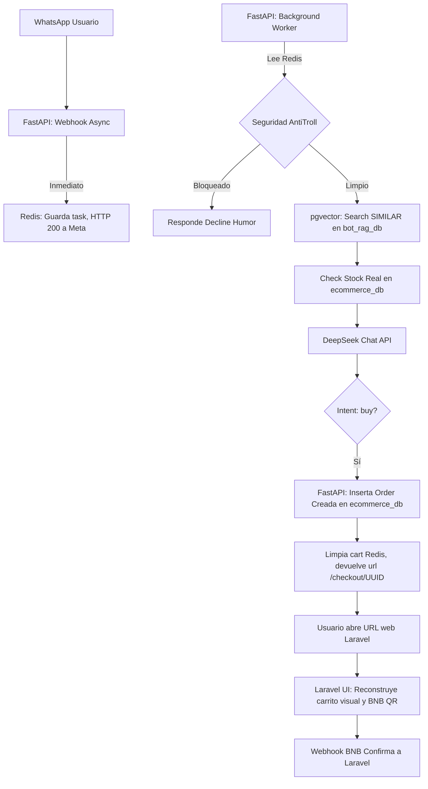

# 📊 Plan Detallado Consolidado: Arquitectura Desacoplada para E-Commerce + Bot IA

**Versión: 3.1 (Ajustada al Desarrollo Actual y Bases de Datos Separadas)**  
**Fecha: 7 de abril de 2026**   
**Propósito:** Este documento expande la conclusión ejecutiva anterior, proporcionando un plan técnico detallado, paso a paso, con ejemplos de código, diagramas y un mapeo exacto de las funcionalidades que **ya hemos construido** (BNB, Anti-Troll, Carritos) hacia la nueva arquitectura.

---

## 🎯 Conclusión Ejecutiva: Arquitectura Óptima para tu Sistema

Tu ecosistema requiere una **arquitectura desacoplada de microservicios** que combine la fortaleza empresarial de Laravel con la inteligencia nativa de Python/FastAPI. PostgreSQL (instancia única) alojará **dos Bases de Datos Lógicas separadas** (sin usar schemas) para garantizar que el bot pueda comercializarse de manera independiente como SaaS a futuro.

### **Beneficios Clave**
- **SaaS First:** La DB del Bot (`bot_rag_db`) queda aislada. Mañana te conectas a un cliente que usa Node.js y el bot ni se entera.
- **Inteligencia Real:** RAG vectorial soluciona la "Ceguera de Atributos" actual.
- **Eficiencia en RAM:** FastAPI maneja llamadas asíncronas reduciendo bloqueos.
- **Memoria Híbrida Real:** Redis para la cola asíncrona; DB para contexto pesado.

---

## 🛠️ Stack Tecnológico Definitivo

| Capa | Tecnología | Rol Detallado | Información de nuestra implementación |
|------|-----------|---------------|-----------------------------------------|
| **E-Commerce / Pasarela** | Laravel 12 + PHP 8.3 | Checkout, Facturación, Panel Filament, QR Sandbox BNB | **Mantenemos:** El controlador `CheckoutController` que genera QR dinámico (BNB Sandbox), lógica de UI web, y tabla `orders` con JSON estructurado. |
| **Cerebro IA** | FastAPI (Python) | Vectorización, RAG, Webhooks asíncronos Meta | **Migramos:** Extraemos el `ProcessWhatsAppMessage` (PHP) a un script asíncrono con `httpx` hacia DeepSeek. |
| **Bases de Datos** | PostgreSQL + pgvector | Aislamiento en 2 BDs lógicas para Single Source of Truth | Migramos todo de MySQL a PostgreSQL (eliminando `MATCH AGAINST`). |
| **Memoria & Colas** | Redis | `chat:{phone}` para memoria NLP | **Mantenemos:** El esquema actual de ventana de chat temporal y `cart:{phone}`. |

---

## 🗄️ Arquitectura de Bases de Datos Aisladas

El acercamiento será **Dos Bases de Datos Lógicas Separadas en una Instancia PostgreSQL** (Garantiza desacoplamiento para vender el Bot aparte). No utilizaremos `schemas`, sino aislamientos totales de bases de datos `CREATE DATABASE`.

### **1. `ecommerce_db` (Controlada por Laravel)**
- **Tablas:** `users`, `products`, `product_variants`, `orders`, `leads`, `client_contexts`.
- **Integridad:** Laravel es dueño absoluto. Gestiona el catálogo, guarda los leads que compran, maneja Filament y la creación de UUIDs para `checkout.blade.php`.

### **2. `bot_rag_db` (Controlada por FastAPI)**
- **Tablas:** `product_embeddings` (Catálogo vectorizado), `message_logs`, métricas de IA.
- **Independencia:** Si nos contrata un cliente externo con un WooCommerce antiguo, su catálogo se importará a nuestra `bot_rag_db` y el bot operará normalmente sin tocar su servidor.

### **¿Cómo se conectan si el Bot necesita validar Stock?**
Para el cliente "DARKOSYNC" (escenario donde hacemos ambos sistemas): FastAPI abrirá **dos pools de conexión**. 
1. Un pool a `bot_rag_db` para realizar el HNSW (búsqueda RAG).
2. Un pool de solo-lectura a `ecommerce_db` para verificar `stock > 0` instantáneamente sin golpear el servidor web de Laravel.

---

## 🔄 Reconstrucción RAG (Reparación de la "Ceguera de Atributos")

Actualmente en Laravel, inyectamos context solo con nombre y precio base (`$ragContext`). Al migrar a PostgreSQL/pgvector, corregiremos esto radicalmente.

**La nueva construcción del Vector en FastAPI será rica:**
```text
"Producto: Funda de Silicona Ultrafina | Precio Base: 800 Bs. | Categoría: Celulares.
Variantes Disponibles:
- iPhone 13, Color: Blanco, Precio Total: 120 Bs, Stock Físico: 29.
- Samsung S20, Color Negro, Precio Total: 120 Bs, Stock Físico: 5."
```
Este bloque de texto entero es el que se convierte a Tensores (Embeddings). Cuando la IA lo lea, ya no inventará que "solo viene en negro", pues la información vectorial apunta directamente a la variante en stock.

---

## 🛡️ Capa de Seguridad (Porting Directo del Código Actual)

Nuestro escudo actual es excelente y será trasladado 1:1 a Python (FastAPI Middleware):

1. **Anti-Troll Interceptor:** Traducción fiel de `containsProhibitedWords`. Analiza insultos ("piter gay", etc.) antes y después de interactuar con DeepSeek. Si hay manipulación, fuerza `intent: troll` y declina con humor casero ("¡Jajaja casero! Casi me haces decir una locura").
2. **Validación de Json de Salida:** DeepSeek se forzará a retornar JSON puro usando `response_format: {"type": "json_object"}`.
3. **Control Descuentos Fijos:** `$discount=0`. No se genera rebaja dinámica.

---

## 🏁 Flujos de Compra (End-to-End con el nuevo Stack)



---

## 🚀 Fases de Implementación Cronológicas

### **Fase 1: Preparación Estructural (Migración de Cimientos)**
- Instalación de PostgreSQL + Extensión `vector`.
- Exportar esquema de MySQL e importarlo como `ecommerce_db`.
- Crear DB `bot_rag_db` e instalar `pgvector`.
- Cambio de `DB_CONNECTION=pgsql` en Laravel. Verificamos que PHP (Blade, checkout, BNB) sintonice y funcione.

### **Fase 2: Cerebro Asíncrono (Construir FastAPI)**
- Crear el repositorio FastAPI. Instalar `asyncpg`, `httpx`, `redis`, `uvicorn`.
- Exponer el endpoint `/webhook/metacloud`.
- Migrar el Prompt Gigante Extricto boliviano y la función de escaneo de Troll.
- Codificar la inserción vectorial (RAG).

### **Fase 3: El Puente (Sincronización Web-Cerebro)**
- En Laravel (Filament), crear un `Observer` en el Modelo Product.
- Cuando creas/editas producto o sus variantes, Laravel manda un POST silencioso a FastAPI: `/api/v1/sync/product`. 
- FastAPI toma el JSON, regenera el texto descriptivo fusionado con las variantes, llama al motor de Embeddings, y actualiza `product_embeddings` en `bot_rag_db`.

### **Fase 4: Go-Live**
- Se elimina todo el boilerplate de WhatsApp y el array de Jobs nativo dentro de Laravel.
- Ngrok Meta Webhook apunta a FastAPI (Puerto 8000).
- Inicio de operaciones B2B listas para escalado.